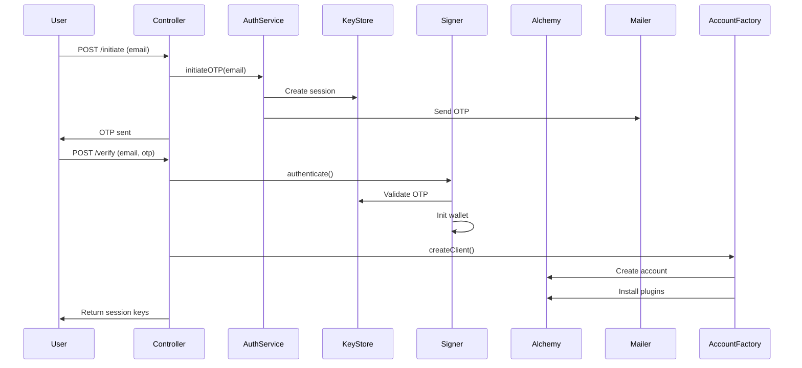

# Documentation: Email OTP Authentication System with Alchemy Account Kit Integration

## Overview
This system provides secure email-based authentication using one-time passwords (OTPs) paired with Alchemy's Account Kit for smart account management. It implements a non-custodial wallet system where users authenticate via OTP while maintaining full control of their cryptographic keys.

## Key Components

### 1. Core Types (`types.ts`)
Defines data structures for:
- **Authentication Parameters**: `{ email, otp }`
- **Session Details**: Contains wallet address, session keys, and timestamps
- **Cryptographic Types**: Ethereum address and hex string type guards
- **Session Keys**: Permissioned keys with expiration times

### 2. Keystore Service (`keystore.service.ts`)
- **In-Memory Session Storage** (production should use secure persistent storage)
- **Mnemonic Generation**: Uses `viem`'s cryptographically secure method
- **OTP Management**: Generates 6-digit codes with 5-minute expiration
- **Session Key Storage**: Maintains active session keys per user

### 3. Authentication Signer (`custom-auth.signer.ts`)
Implements Alchemy's `SmartAccountAuthenticator` interface:
- **OTP Verification**: Validates email/OTP combinations
- **Mnemonic Wallet**: Derives keys from BIP-39 mnemonics
- **Session Key Generation**: Creates limited-access keys via `SessionKeySigner`
- **Signing Operations**: Full EIP-712 and message signing capabilities

### 4. Account Factory (`account.factory.ts`)
Handles Alchemy Account Kit integration:
- **Modular Account Creation**: Uses `@alchemy/aa-core`
- **Session Key Plugin**: Auto-installs session management plugin
- **Permission Management**: Default spend limits and access controls

### 5. Authentication Service (`auth.service.ts`)
Orchestrates the OTP workflow:
- **Email Delivery**: Integrates with NestJS Mailer
- **Session Initialization**: Coordinates keystore and signer setup

### 6. API Controller (`auth.controller.ts`)
Exposes two endpoints:
1. `POST /auth/initiate`: Start OTP flow
2. `POST /auth/verify`: Complete authentication

## Workflow Diagram



## Security Architecture

1. **OTP Protection**
   - 6-digit code valid for 5 minutes
   - Single-use per generation
   - Rate-limited by service implementation

2. **Key Management**
   - Mnemonics never persisted to disk
   - Session keys auto-expire after 1 hour
   - Separate signing keys for different operations

3. **Wallet Protection**
   - Hierarchical deterministic wallet from mnemonic
   - Zero persistent private key storage
   - Session keys with limited permissions

## Setup Requirements

### Environment Variables
```bash
# Email Service
EMAIL_HOST=smtp.example.com
EMAIL_PORT=587
EMAIL_USER=admin@example.com
EMAIL_PASSWORD=secure_password

# Blockchain
ALCHEMY_KEY=your_alchemy_key
CHAIN_NETWORK=sepolia
```

### Dependencies
```json
{
  "@aa-sdk/core": "^1.0.0",
  "@account-kit/smart-contracts": "^1.2.0",
  "@alchemy/aa-core": "^2.1.3",
  "viem": "^1.0.0",
  "@nestjs-modules/mailer": "^10.0.0"
}
```

## Integration with Alchemy Account Kit

The system leverages three key Account Kit features:

1. **Modular Accounts**
   ```typescript
   createModularAccountAlchemyClient({
     chain: 'sepolia',
     transport: alchemyTransport,
     signer: customSigner
   })
   ```

2. **Session Key Plugin**
   ```typescript
   client.extend(sessionKeyPluginActions)
   ```

3. **Permission Management**
   ```typescript
   new SessionKeyPermissionsBuilder()
     .setNativeTokenSpendLimit(1000000)
     .setContractAccessControl(ALLOW_ALL)
   ```

## Maintenance Considerations

1. **Session Storage**: Current in-memory implementation should be replaced with secure persistent storage for production
2. **OTP Delivery**: Implement queueing and retry logic for email delivery
3. **Key Rotation**: Add periodic mnemonic rotation strategy
4. **Monitoring**: Add logging for authentication attempts and key usage
5. **Rate Limiting**: Implement request throttling on authentication endpoints

This architecture provides a foundation for building secure, non-custodial applications using email-based authentication while maintaining compatibility with Ethereum smart accounts through Alchemy's infrastructure.